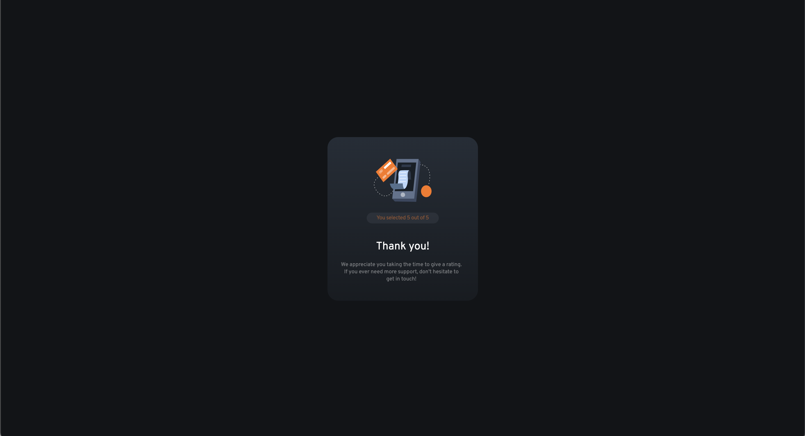

# Frontend Mentor - Interactive rating component solution

This is a solution to the [Interactive rating component challenge on Frontend Mentor](https://www.frontendmentor.io/challenges/interactive-rating-component-koxpeBUmI). This is built using React and Tailwind CSS.

## Table of contents

- [Overview](#overview)
  - [The challenge](#the-challenge)
  - [Screenshot](#screenshot)
  - [Prerequisites]
  - [Setup]
  - [Links](#links)
- [My process](#my-process)
  - [Built with](#built-with)
  - [What I learned](#what-i-learned)
- [Author](#author)

## Overview

### The challenge

Users can:

- View the optimal layout for the app depending on their device's screen size
- See hover states for all interactive elements on the page
- Select and submit a number rating
- See the "Thank you" card state after submitting a rating

### Screenshot

### Prerequisites 

- Node.js and npm installed on your machine.

### Setup
1. Clone the repository:

git clone 

2. Navigate to the project directory:

cd interactive-rating-component-main

3. Install the necessary dependencies:

npm install 

4. Run the development server and view project locally:

npm run dev

### Links

- Solution URL: [Github](https://github.com/BKFOE/interactive-rating.git)
- Live Site URL: [Github Pages](https://your-live-site-url.com)

## My process

### Built with

- [React](https://reactjs.org/) - JS library
- [Next.js](https://nextjs.org/) - React framework
- [Tailwind](https://tailwindcss.com/) - Tailwindcss
- [Vite](https://vitejs.dev/) - Vite 

### What I learned
Initially, when planning I wanted to use JQuery with React but that is bad practice, so I used the DOM and vanilla javascript to create the behavior in the card. DOM worked better in this instance despite being more verbose and complex. 

I approached this by thinking through my end result. I knew it required the user to have the ability to select a rating and once submitted a new card is shown with the selected rating. 

//const [showContent, setShowContent] = useState(false);
//const [rating, setRating] = useState(null);

//const handleSubmit = (e) => {
    e.preventDefault();
    if (rating !== null) { // Rating is submitted 
      setShowContent(true); // Hide the original card and show the SubmitCard
    }

  };

  I used the map function to iterate through the different ratings and assign the value to the key.
  
  // {[1, 2, 3, 4, 5].map((num) => ( // Rating array that we use the map function to iterate through and store value  
          <button 
            key={num}
            className={`w-circle h-circle rounded-full flex justify-center items-center mr-4 text-xs font-bold transition-colors duration-300
                  ${rating === num ? 'bg-white text-neutral-darkBlue' : 'bg-neutral-lightGrey/10 text-white/50 hover:bg-primary-orange hover:text-neutral-darkBlue'}`} 
            onClick={() => setRating(num)}>
              {num}
            </button>
        ))}

## Author

- Website - [BKFOE](https://github.com/BKFOE)
- Frontend Mentor - [@BKFOE](https://www.frontendmentor.io/profile/bkfoe)
