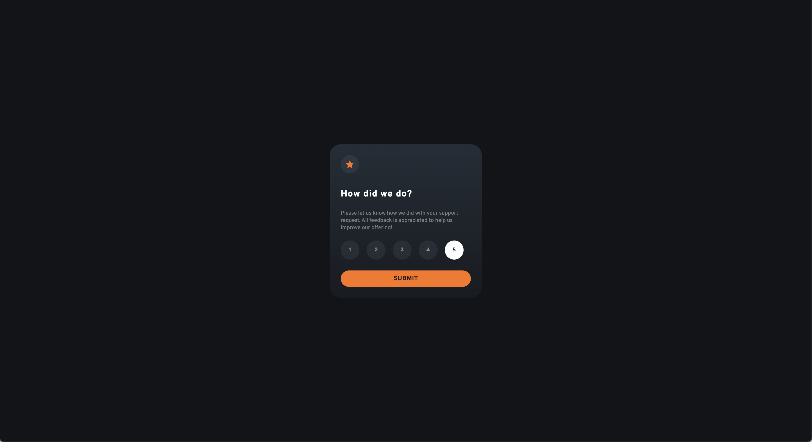
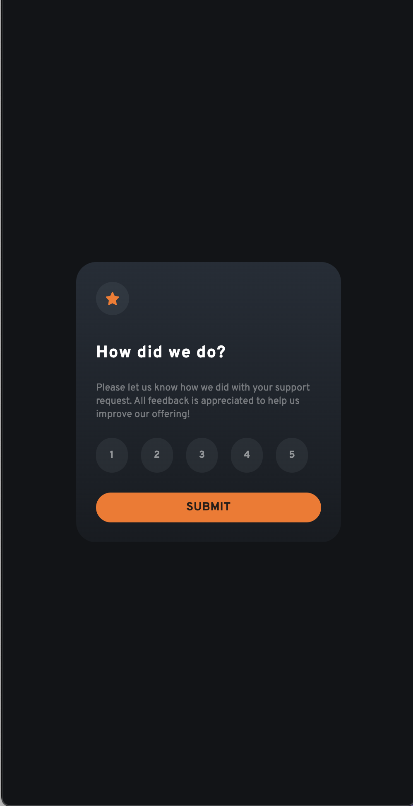

# Frontend Mentor - Interactive rating component solution

This is a solution to the [Interactive rating component challenge on Frontend Mentor](https://www.frontendmentor.io/challenges/interactive-rating-component-koxpeBUmI). This is built using React and Tailwind CSS.

## Table of contents

- [Overview](#overview)
  - [The challenge](#the-challenge)
  - [Screenshot](#screenshot)
  - [Prerequisites]
  - [Setup]
  - [Links](#links)
- [My process](#my-process)
  - [Built with](#built-with)
  - [What I learned](#what-i-learned)
- [Author](#author)

## Overview

### The challenge

Users can:

- View the optimal layout for the app depending on their device's screen size
- See hover states for all interactive elements on the page
- Select and submit a number rating
- See the "Thank you" card state after submitting a rating

### Screenshot

### Prerequisites 

- Node.js and npm installed on your machine.

### Setup
1. Clone the repository:

git clone 

2. Navigate to the project directory:

cd interactive-rating-component-main

3. Install the necessary dependencies:

npm install 

4. Run the development server and view project locally:

npm run dev

### Links

- Solution URL: [Github](https://github.com/BKFOE/interactive-rating.git)
- Live Site URL: [Github Pages](https://your-live-site-url.com)

## My process

### Built with

- [React](https://reactjs.org/) - JS library
- [Next.js](https://nextjs.org/) - React framework
- [Tailwind](https://tailwindcss.com/) - Tailwindcss
- [Vite](https://vitejs.dev/) - Vite 

### What I learned

## Author

- Website - [BKFOE](https://github.com/BKFOE)
- Frontend Mentor - [@BKFOE](https://www.frontendmentor.io/profile/bkfoe)
